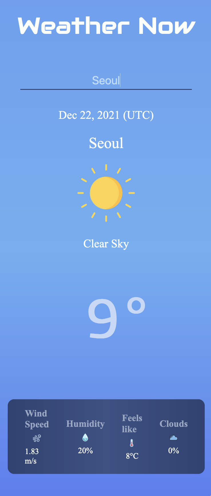

# Weather Now

<p align="center"></p>

This is a simple weather app made with Vue. 

Due to limitations of the free tier API (https://openweathermap.org/api) it only displays the current time.

A <b>live demo</b> can be accessed <a href="https://determined-bose-20713e.netlify.app/">here</a>.

*** 

## Project setup
```
npm install
```

### Compiles and hot-reloads for development
```
npm run serve
```

### Compiles and minifies for production
```
npm run build
```

### Lints and fixes files
```
npm run lint
```

### Customize configuration
See [Configuration Reference](https://cli.vuejs.org/config/).
